# AWS Certified Data Engineer (DEA-C01) Cheat Sheet

The following are my personal notes in preparation for the AWS Certified Data Engineer Certification (DAE-C01). 

## Table of Contents

- [Notes from other exam takers (from r/dataengineering reddit comments and other sources)](#notes-from-other-exam-takers-from-rdataengineering-reddit-comments-and-other-sources)
- [Storage](#storage)
   * [Simple Storage Service (S3)](#simple-storage-service-s3)
   * [Elastic Block Storage (EBS)](#elastic-block-storage-ebs)
   * [Elastic File System (EFS)](#elastic-file-system-efs)
   * [Comparisons between storage types](#comparisons-between-storage-types)
   * [AWS Backup](#aws-backup)
- [Databases](#databases)
   * [DynamoDB](#dynamodb)
   * [RDS, Amazon Aurora](#rds-amazon-aurora)
   * [Redshift**](#redshift)
- [Migration and Transfer](#migration-and-transfer)
   * [Application Migration Service](#application-migration-service)
   * [Database Migration Service (AWS DMS)](#database-migration-service-aws-dms)
   * [DataSync](#datasync)
   * [Snow Family](#snow-family)
   * [AWS Transfer Family](#aws-transfer-family)
- [Compute](#compute)
   * [EC2](#ec2)
   * [AWS Lambda](#aws-lambda)
   * [Serverless Application Model (SAM)](#serverless-application-model-sam)
   * [AWS Batch](#aws-batch)
- [Containers](#containers)
   * [Elastic Container Service (ECS)](#elastic-container-service-ecs)
   * [Elastic Container Registry (ECR)](#elastic-container-registry-ecr)
   * [Elastic Kubernetes Service (EKS)](#elastic-kubernetes-service-eks)
- [Analytics](#analytics)
   * [Glue**](#glue)
   * [Glue DataBrew](#glue-databrew)
   * [Lake Formation](#lake-formation)
   * [Athena](#athena)
   * [Amazon Elastic MapReduce (EMR)](#amazon-elastic-mapreduce-emr)
   * [Kinesis Data Streams, Firehose -> last](#kinesis-data-streams-firehose)
   * [Amazon Managed Streaming for Apache Kafka (MSK)](#amazon-managed-streaming-for-apache-kafka-msk)
   * [OpenSearch Service](#opensearch-service)
   * [QuickSight](#quicksight)
- [App Integration](#app-integration)
   * [SQS](#sqs)
   * [SNS](#sns)
   * [Step Functions**](#step-functions)
   * [AppFlow](#appflow)
   * [EventBridge](#eventbridge)
   * [Amazon Managed Workflows for Apache Airflow (MWAA)](#amazon-managed-workflows-for-apache-airflow-mwaa)
- [Security, Identity and Compliance](#security-identity-and-compliance)
   * [Principles](#principles)
   * [IAM](#iam)
   * [KMS](#kms)
   * [Secrets Manager](#secrets-manager)
   * [WAF, Shield](#waf-shield)
- [Networking and Content Delivery](#networking-and-content-delivery)
   * [VPC](#vpc)
   * [AWS PrivateLink](#aws-privatelink)
   * [Route53](#route53)
   * [CloudFront](#cloudfront)
- [Management and Governance](#management-and-governance)
   * [CloudWatch](#cloudwatch)
   * [CloudTrail, CloudTrail Lake](#cloudtrail-cloudtrail-lake)
   * [AWS Config](#aws-config)
   * [AWS CloudFormation](#aws-cloudformation)
   * [SSM Parameter Store](#ssm-parameter-store)
- [Machine Learning](#machine-learning)
   * [Sagemaker](#sagemaker)
- [Developer Tools](#developer-tools)
   * [AWS CDK](#aws-cdk)
   * [CodeDeploy, CodeCommit, CodeBuild, CodePipeline](#codedeploy-codecommit-codebuild-codepipeline)
- [Acknowledgements](#acknowledgements)

## Notes from other exam takers (from r/dataengineering reddit comments and other sources)

- There were questions that focused on specific choosing the right SQL queries and performance tuning and consolidation for data coming from multiple datasets and various formats. Data Lake, Red Shift, various RDS flavors and lots of AWS Glue and some Kinesis were common in questions
- DAS covers Analytics section, DEA does not. DEA covers a little CI/CD, DAS does not. DEA focuses more on implementation and some sql stuff, DAS more on design and big data. The exam guides list everything. The overlap seems to be 80% of DEA is 60% of DAS. Overall, DEA is an easier subset of DAS. IMHO.
- Lots of glue *** (close to 20 questions)
- Lots of redshift *** (close to 20 questions)
- 1 sql query question (finding what’s wrong)
- Assume knowledge on SAA
- End to End flow from Data Ingestion to Data Visualisation and the AWS tools which are able to perform those tasks
- No questions on SageMaker
- Very few questions on Containers (1-2)
- ETL ***
- Data warehouse and Databases

## Storage

### Simple Storage Service (S3)

- Stores any kind of data (i.e. serves as a data lake) as objects (files) within buckets.
- Max size of an object is 5TB, no limit for the number of objects stored (infinitely scalable).
- Multipart upload loads the data parallely, used for object size >100MB and recommended if size > 5GB.

**Storage classes**

- S3 Standard - For Big Data Analytics/Mobile apps etc. Used for frequently accessed data. Has less latency and high throughput.
- S3 Standard-IA - For less frequently accessed data (not accessed for 30 days), rapid access when needed. Costs less.
- S3 Standard-One ZoneIA - For less frequently accessed data (not accessed for 30 days), rapid access when needed. Stored in single AZ.
- S3 Glacier
    - Glacier Instance retrieval - Data access once a quarter (90 days). Millisec data retrieval
    - Glacier Flexible retrieval- Data access once a quarter (90 days). Can wait up to 12hrs for data retrieval
    - Glacier Deep Archive - Data access once in 180 days. Can wait up to 48 hours for retrieval. Lowest cost.
- S3 Intelligent Tiering - Automatic movement of objects between storage classes

**S3 Lifecycle Rules**
- Transition Actions - Defines when objects are transitioned to other storage classes.
- Expiration Actions - Define when objects will be expired (deleted) from the bucket

**Versioning**: New version ID will be created every upload. Any file not versioned prior to enabling versioning will be set to null.

**S3 Replication**
- Must enable versioning in source and dest for doing replication. Replication is not chained. (A > B > C)
- Cross-region replication - Async replication to a bucket in different region. Used for compliance/lower-latency access
- Same-region replication - Log aggregation, live replication between diff accounts.
- S3 automatically scales to high request rates and gives 5500 GET and 3500 PUT/POST per prefix.

**S3 Transfer Acceleration**: Used to increase transfer speed by transferring a file to edge location which will then forward the data to S3 bucket in target region.

**S3 Encryption**

- Server-side Encryption
- Amazon S3-Managed Keys (SSE-S3) -AWS managed encryption Keys
- AWS KMS-Managed Keys (SSE-KMS) - AWS Key Management service to manage keys, rate limit of KMS is applied.
- Customer-Provided Keys (SSE-C) - Client provided keys. https mandatory
- Client-side Encryption
- Client-side master key - Encryption done at client side

**S3 Security**

- User based - IAM policies
- Resource based - Bucket policies /Object ACL's
- Network based - support Gateway VPC endpoint for other services to access S3 via private network.

**S3 Select and Glacier Select****: Query subset of S3 data in place using SQL. Can be performed on uncompressed csv files.

### Elastic Block Storage (EBS)

- Network “USB stick” attached to instance while they run - uses network so can have latency
- Can persist data after termination
- Only mount to one instance at a time, bound to one AZ
- Move across AZs using snapshots
- Can be detached and re-attached quickly
- Provision capacity by GBs and IOPS
- Delete on termination - root deleted by default, others are not

**EBS Elastic Volumes****

- No need to detach or restart to change it. can only increase volume size, cannot decrease. Can change volume type and IOPS

### Elastic File System (EFS)

- Managed Network file system (NFS) can be mounted on many EC2
- Works with EC2 instances in multi-AZ
- Highly available, scalable (auto), EXPENSIVE (3x gp2), pay per use
- Security group used to control access
- Compatible only with Linux based AMI, not windows
- Encryption at rest using KMS

**Performance and Storage Classes**

- EFS Scale: 1000s of concurrent NFS clients, auto-grow to petabyte-scale
- Performance Mode (set at creation): General Purpose or Max I/O
- Throughput Mode: Bursting or Provisioned or Elastic

**Storage Tiers**

- Standard: frequently accessed
- EFS-IA: cost to retrieve, cheaper to store - use Lifecycle policy

**Availability and durability**

- Standard is multi-AZ, One Zone is great for dev, backup enabled by default, compatible with IA with >90% cost savings

### Comparisons between storage types

**EBS vs EFS**

| EBS | EFS |
| --- | --- |
| Manual setup | Managed |
| Dedicated direct access | Shared across instances |
| Tighter cost controls, more fixed storage needs | 3x price, dynamic pay per use |
| Single volume max 16/64TB | Unlimited storage |
| Single AZ | Multi-AZ, One zone |

**Storage services comparison: S3 vs EBS vs EFS vs FSX**

| S3 | EBS | EFS | FSx |
| --- | --- | --- | --- |
| Object storage service. | Block storage service | File storage system. | Storage system for Windows |
| Designed to provide archiving and data control options and to interface with other services beyond EC2 | Designed to act as storage for a single EC2 instance | Designed to provide scalable storage for multiple EC2 instances | Designed as a storage for Windows |
| Web Interface | File System interface | Web and file system interface | File system interface for windows. |
| Infinitely Scalable | Hardly Scalable | Scalable | Fully scalable |
| Fast | Fastest | Faster | Faster |
| Good for storing backups and other static data | Only available with EC2 as drive | Good for applications and shareable workloads | Good for compute intensive workloads |
| Used mostly in Big Data Analytics, Backups/archives/Web content management | Boot volumes, Transaction and No-SQL Databases | Big Data Analytics, Backups/archives | Data analytics, media and entertainment workflows, web serving and content management |

### AWS Backup

- Fully managed service
- Centrally manage and automate backup across AWS services
- No need to create custom scripts and manual processes
- Supports: EC2, EBS, S3, RDS, DocumentDB, EFS, Storage Gateway, etc.
- Supports both cross-region and cross-account backups
- On-demand and scheduled, tag-based

**Backups plans:** can be specified by frequency, window, transition and retention period

**Backup Vault Lock**

- Enforce a Write Once Read Many (WORM) state for all bakcups stored in backup vault
- Additional layer of defense, even root user cannot delete backups when enabled

## Databases

### DynamoDB

- Fully managed, highly available with replication across multiple AZs with 100s of TB of storage.
- No-SQL serverless database - non-relational databases which are distributed which give horizontal scalability
    - Dont support query joins/aggregations i.e.., all the data is present in one single row.
- Low cost with auto-scaling capability.

**DynamoDB tables**: Consists of partition key or a combination of partition key + sort key = primary key. 

- Each table can have infinite number of rows.
- Each row/item can have max. size of 400KB

**Use cases**: Mobile Gaming/Metastore for S3 objects/live voting/ec-commerce cart/OLTP use cases/web-session management.

**Read/Write Capacity modes**

- **Provisioned mode** - Planned capacity beforehand, to provision both Read and Write Capacity units
- **On-demand Mode** - capacity unknown prior to table creation, more expensive.
    - Read Capacity Unit (RCU): 1 RCU represents one strongly consistent read and 2 eventually consistent reads per second for an item of size 4KB.
    - Write Capacity Unit (WRU): 1 WCU Represents one Write per sec for item/row of size 1kb. For items > 1KB more WCU are consumed.

- DynamoDB stores data in partitions. WCUs and RCUs are spread evenly across all partitions.

**ProvisionedThroughputExceededException** occurs because:

- Hot partition or hot key
- Very large items.
- Resolved by:
    - Exponential backoff
    - Distribute the partition key
    - Enable DynamoDB Accelerator (DAX) to solve hot key problem

**Local Secondary Index (LSI)**: query within a partition

- Must be created at the time of table creation and cannot be changed later.
- Up to 5 LSI per table.
- Attribute projections may contain some or all attributes of the base table.
- Uses WCU and RCU of main table

**Global Secondary Index(GSI)**: partition + Sort key; query over whole table across partitions

- Used to speed up queries on non-key attributes.
- Must have WCU and RCU defined for the GSI.
- If throttling occurs after provisioned WCU+RCU used up, main table is also throttled.
- Up to 20 GSI per table.

**PartiQL**: SQL-like syntax to manipulate DynamoDB tables. Only allow INSERT, UPDATE, SELECT, DELETE. Supports batch operations. Access through PartiQL editor in console.

**DynamoDB Accelerator(DAX)**: Fully managed in-memory cache for DynamoDB with microsecond latency. 

- Solves hot key problem
- DAX cluster acts as a layer between app and DynamoDB table to get very fast reads.
- vs ElastiCache: DAX for simple queries like individual objects, query and scan; while ElastiCache is used for storing filtering and aggregation result that is computationally intensive

**DynamoDB Streams** - Ordered streams of item level modifications in a DynamoDB table made of shards .

- Can be sent to Kinesis Data Streams/Lambda/KCL etc. Data retention is 24 hrs.
- Information written to the stream:
    - KEYS_ONLY, NEW_IMAGE, OLD_IMAGE, NEW_AND_OLD_IMAGES
- Define an Event Source Mapping to read from a DynamoDB Stream

**DynamoDB Time To Live (TTL)** - Expire items after a specific timestamp. Mostly used in web session management. 

- Does not consume any WCU.
- Must be based on a Number datatype with ‘Unix Epoch timestamp’ value

**DynamoDB integrations**

- **Producers**: Client SDK,DMS (Database Migration Service), AWS Data Pipeline
- **Consumers**: DynamoDB Streams, Glue(metadata store), EMR (Hive)

**Notes**

- DynamoDB Queries finds items based on primary key values. You can query any table or secondary index(GSI or LSI) that has a composite primary key (a partition key and a sort key).You must specify the partition key name and value as an equality condition and optionally provide a second condition for the sort key. The sort key condition must use one of the following comparison operators: =, <, <=, >, >=, BETWEEN, AND.
- DynamoDB Scan operation reads every item in a table or a secondary index. By default, a Scan operation returns all of the data attributes for every item in the table or index. An inefficient way of reading data as it consumes lot of RCU's.
- DynamoDB can be accessed using gateway VPC endpoint from other services without the internet. Access to tables is also fully controlled by IAM. Has in-flight and at rest encryption.

### RDS, Amazon Aurora
- Hosted relational DB - Aurora, MySQL, PostgreSQL, MariaDB, Oracle, SQL Server
- ACID - Atomicity, Consistency, Isolation, Durability
    - Aurora is MySQL and PostgreSQL compatible
        - Up to 128TB/vol, up to 15 read replicas, continuous backup to S3
        - Aurora Serverless offers automatic scaling

**Security**: VPC, At-rest KMS, In-transit SSL

- LOCK command (on entire table): prevent two writes/reads at the same time
    
    `LOCK TABLES employees WRITE; UNLOCK TABLES`
    
- Shared locks `FOR SHARE`: Allow reads, prevent writes, can be held by many transactions
- Exclusive locks `FOR UPDATE`: Prevent all reads/writes to resource. Only by 1 transaction.

**Best practices**

- CloudWatch to monitor memory, CPU, storage, replica lag
- Perform auto-backups during daily low in write IOPS
- Insufficient I/O will make recovery after failure slow
    - Migrate to DB with more I/O, move to General Purpose, Provisioned IOPS storage
- Set TTL on DNS for DB instances to 30s or less
- Test failover before you need it
- Provision enough RAM to include your entire working set
- Rate limits in Amazon API Gateway can be used to protect DB
- Query Optimisation
    - Use indexes to accelerate SELECT, use EXPLAIN plans to identify suitable indexes
    - `ANALYZE TABLE` periodically to ensure table in good health
- DB-Specific tweaks
    - MySQL, MariaDB: tables < 16TB, ideally <100GB, have enough RAM, <10,000 tables, use InnoDB for storage engine
    - PostgreSQL: dataload: disable DB backups and multi-AZ. use auto-vaccum
    - SQL Server: use RDS DB Events to monitor failovers, do not enable simple recover mode, offline mode, or read-only mode, deploy into all AZs

### Redshift**

- Petabyte-scale data warehouse service on AWS
- Run analytic queries against petabytes of data stored locally in Redshift
- Run directly against exabytes of data stored in S3
- Columnar storage (block size of 1MB), data compression. Uses MPP (massively parallel processing) data warehouse architecture to parallelize and distribute SQL operations.

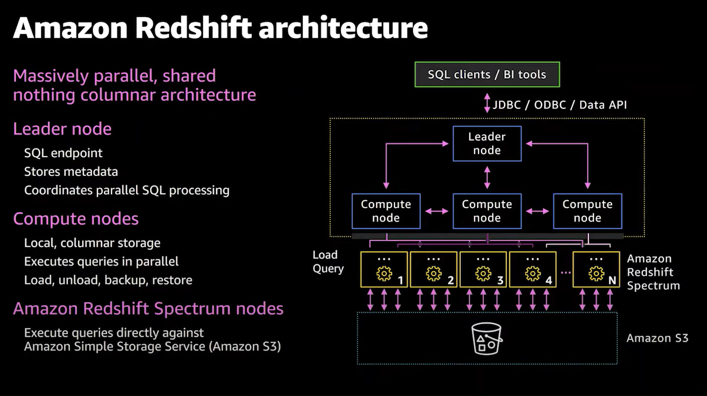

**ANALYZE command** `auto_analyze` (default `true`): run stats to optimise query planning.

**Data replication** - 3 copies of data - original, replica on compute node, automatic async continuous backup to S3 as snapshots in another region for disaster recovery.

- Failed drives/nodes are automatically replaced
- Single-AZ deployments by default, only RA3 clusters support multi-AZ deployment

**Scaling Redshift** - Vertical and horizontal scaling on demand

- New cluster created while old remains available for reads
- CNAME flipped to new cluster (few mins of downtime)
- Data moved in parallel to new nodes

**Redshift Nodes**

- Leader node: Receives queries from client applications, parses queries, and develops query execution plans. It then coordinates the parallel execution of these plans with the compute nodes and aggregates the intermediate results from these nodes. Finally, it returns the results back to the client applications.
- Compute nodes (1-128): Execute the query execution plans and transmit data among themselves to serve these queries. The intermediate results are sent to the leader node for aggregation before being sent back to the client applications. Compute nodes are further divided into slices. Slices/node depends on node size.

**Node Types**

- Dense storage (DS) node type – for large data workloads and use hard disk drive (HDD) storage. DS2 nodes allow up to 16TB of HDD storage per node but only at a maximum of 3.30 GB/s of I/O performance.
- Dense compute (DC) node types – optimized for performance-intensive workloads. Uses SSD storage. DC2 nodes allow only up to 2.56TB storage per node but with a very high I/O performance of 7.50 GB/s.
- RA3 (Managed storage) - choose number of nodes based on performance requirements, only pay for managed storage usage.
    - Enable independent scaling of compute and storage, SSD-based
    - Allows for live data cross-region sharing without copying

**Parameter Groups** – a group of parameters that apply to all of the databases that you create in the cluster. The default parameter group has preset values for each of its parameters, and it cannot be modified.

**Redshift Spectrum**: Serverless scalable layer to query exabytes of data in S3 without loading. Limitless concurrency, horizontal scaling. 

- Associate IAM role with Amazon Redshift cluster
- Create an external schema and external table:
    
    ```
    CREATE EXTERNAL SCHEMA myspectrum_schema 
    FROM DATA CATALOG 
    DATABASE 'myspectrum_db' 
    IAM_ROLE 'arn:aws:iam::123456789012:role/myspectrum_role'
    CREATE EXTERNAL DATABASE IF NOT EXISTS; 
    ```
- (For csv file)
    ```
    CREATE EXTERNAL TABLE spectrum.sales(
    salesid integer,
    ...    
    saletime timestamp)
    row format delimited
    fields terminated by '\t'
    stored as textfile
    location 's3://awssampledbuswest2/tickit/spectrum/sales/'
    table properties ('numRows'='170000');
    ``` 

**Redshift Data Distribution styles**

- **EVEN** - leader node distributes rows across slices round-robin regardless of values in any particular column. Appropriate when a table does not participate in joins or when there is not a clear choice between KEY distribution and ALL distribution.
- **KEY** - The rows are distributed according to values in one column. The leader node places matching values on the same node slice. If you distribute a pair of tables on the joining keys, the leader node collocates the rows on the slices according to the values in the joining columns → matching values from common columns physically stored together.
- **ALL** - Copy of entire table distributed to every node. Appropriate only for relatively slow-moving tables; i.e. not updated frequently or extensively.
- **AUTO** - Redshift assigns optimal distribution style based on the data size of table.

**Redshift Sort Keys**

- Rows stored on disk in sorted order based on chosen sort key col. Works like an index.
- SINGLE, COMPOUND (default, multiple columns, in specified order), INTERLEAVED (equal weight to each column or subset of columns for each sort key)

**Data import/export for Redshift**

- `COPY` cmd: parallelized, efficient; from S3, EMR using SSH, DynamoDB;
    - Need manifest file + IAM role
    - Meant for large amounts of data from outside Redshift
    - Can decrypt data from S3 load w hardware-accelerated SSL, fast
    - Auto-compression option during load
    - *When loading narrow tables (many rows, few columns) → use single `COPY` command
- **Snapshot** `COPY` **grant** for cross-region snapshot backup of encrypted cluster
    - Create KMS key if not avail
    - Specify unique name for the snapshot copy grant
    - Specify KMS key ID for which you are creating the copy grant
    - Enable copying of snapshots in source region to copy grant
- **Internal data transfer in Redshift:** `INSERT INTO … SELECT` or `CREATE TABLE AS`
- **DBLINK**: Connect and sync between Redshift and PostgreSQL (possibly in RDS)
- `UNLOAD`: store as files in S3 (can be Parquet format - auto preserve partitioning)
- Auto-copy from S3
- **Zero-ETL** from Aurora DB to Redshift
- **Redshift Streaming Ingestion** - from kinesis data streams and MSK

**Redshift Workload Management (WLM)**

- Prioritise short fast queries over slow, long queries using separate query queues using service classes (different keys)
- Automatic - up to 8 queues, default 5 queues with even memory allocation
    - Large queries - concurrency lowered; Small queries - concurrency raised
- Manual - one default queue, concurrency level of 5 at once
    - Superuser queue with concurrency level 1
    - Define up to 8 queue up to concurrency level 50
    - Query queue hopping - timeout queries hop to different queue
- Configurations: priority, scaling mode, user groups, query groups, monitoring rules
- **Short Query Acceleration (SQA)**: Prioritise short-running queries over long ones
    - `CREATE TABLE AS (CTAS)`, Read-only queries (`SELECT` statements)
    - Use ML to predict, can configure how many seconds is “short”

**`VACUUM` command** - Recover space from deleted rows

- Options: `FULL`, `DELETE ONLY`, `SORT ONLY` (does not reclaim disk space), `REINDEX`

**Concurrency scaling** - auto-add cluster capacity to handle more concurrent read queries

- Segregate different types of queries (e.g. bursty queries) so some are allowed to scale while others are not

**Redshift scaling/resizing**

- Elastic resize: quickly add or remove **nodes of same type** from existing cluster
    - Change node type possible but drops connections.
    - Connections are held open if possible.
    - During the resize operation, the cluster is read-only.
- Classic resize: **change node type** and/or number of nodes
    - Copies tables to a new cluster. Source cluster read-only mode.
    - Takes 2 hours–2 days or longer, depending on your data's size.
- Snapshot, restore, resize: keep cluster available during classic resize
    - Copy cluster, resize new cluster, swap out

**Advanced Query Accelerator (AQUA)**: Layer between S3 and Redshift cluster

- Do processing closer to where the data sits
- Only available on ra3.4xl ,ra3.16xl
- 10X faster, no extra cost, no code changes, high bandwidth connection to S3

**Amazon Redshift ML**: use CREATE MODEL sql command to create ML model to Sagemaker

**Redshift Security**

- Use either AWS KMS or hardware security module (HSM)
    - HSM requires client and server cert to configure trusted conn between RS and HSM
    - Migrating from unencrypted to HSM-encrypted → copy to newly created cluster
- Define access privileges for user or group: Use GRANT or REVOKE in SQL

**Redshift Serverless**: Auto scale+provision workload - pay only what you use

- Easily spin up dev and test environments
- Serverless endpoint, JDBC/ODBC connection, or just query through console
- Requires IAM created with redshift-serverless:* ALLOW statement
- Scaling - RPU based per second plus storage
    - Adjust Base RPU, defaults to AUTO, can set Max RPU
- Cannot support Redshift Spectrum, Param groups, WLM, partner integration
- No public endpoints, only within VPC
- Monitoring views, CloudWatch logs, CloudWatch Metrics

**Materialised Views**: Contains precomputed results based on SQL queries over one or more base tables (differs from normal view, results are stored)

- Provide way to speed up complex queries esp. large tables
- Beneficial for predictable and recurring queries, eg. dashboards for reporting
- Mat. views can be based on other mat. views.
- Cons: synchronisation problem, need to explicitly refresh view

**Data Sharing** - securely share live data across redshift clusters for read purposes

- Workload isolation, Cross-group collab, sharing between dev/test/prod
- Licensing data access in AWS data exchange
- Can share DBs, schema, tables, views, and/or UDFs
- Use Producer/consumer architecture
- Both must be encrypted and use RA3 nodes
- Types: standard, AWS Data Exchange, Lake Formation - managed

**Redshift Lambda UDF** - use custom functions in AWS Lambda inside SQL

- Call external services and systems, or integrate with location service
- Register with `CREATE EXTERNAL FUNCTION` - must `GRANT USAGE` for permissions
- Cluster IAM role must grant permissions to Lambda
- Communicates with Lambda using JSON

**Redshift Federated Queries**: query and analyse across DB, DWH and lakes

- Tie RS to Amazon RDS or Aurora (Postgres, MySQL)
- Incorporate live data in RDS into RS queries; Avoid need for ETL pipelines
- Offload computation to remote DBs to reduce data movement
    - Establish connectivity between RS and RDS/Aurora - VPC subnet or VPC peering
    - Credentials stored in AWS Secrets Manager, inclusdes secrets in IAM role for RS
    - Connect using `CREATE EXTERNAL SCHEMA`
    - **`SVV_EXTERNAL_SCHEMAS` view contains available external schemas
- Read-only access to external data sources, costs incurred on external DBs

**Redshift System tables and views**** - info about how Redshift is functioning

- **SYS**: usage, **STV**: snapshots of current sysdata, **SVV**: metadata, **STL**: logs, **SVCS, SVL**: query details

## Migration and Transfer

### Application Migration Service

**Application Discovery Service**: plan migration projects by gathering info from on-prem DCs

- Agentless, agent-based discovery

**AWS Application Migration Service (MGN)**

- Lift-and-shift (rehost) solution to simplify migration apps to AWS

### Database Migration Service (AWS DMS)

- Quick and securely migrate DBs to AWS, resilient, self-healing
    - Continuous Data Replication using Change Data Capture (CD)
    - Must create EC2 instance to perform replication tasks
- AWS Schema Conversion Tool (SCT) : convert DB schema from one engine to another
    - OLTP to OLTP, OLAP to OLAP
- Multi-AZ deployment - Synchronously stand replica in different AZ → data redundancy, eliminate i/o freeze, data spikes

### DataSync

- Moving large amount data to and from:
    - on-prem/other cloud to AWS - needs agent
    - AWS to AWS - no agent needed
- Sync to S3 (any class including Glacier), EFS, FSx
- Not continuous, can be scheduled hourly, daily, weekly
- Preserve file permissions and metadata (NFS POSIX, SMB) - only option that does this
- One agent task can use 10Gbps, setup bandwidth limit so it does not max out bandwidth

### Snow Family

- Highly-secure, portable offline devices to collect and process data at the edge, and migrate data into and out of AWS → Avoid connectivity limits and high network cost
- Snowball Edge: 80TB HDD Storage Optimized, 42TB HDD/28TB NVMe Compute Optimised
- Snowcone: Small rugged portable computing - 8TB HDD/14TB SSD
    - For space-constrained environments, can use DataSync via internet to send data
- Snowmobile: exabytes of data (1EB = 1,000 PB = 1,000,000 TBs), 100PB each
    - Better if data > 10PB

### AWS Transfer Family

- Fully-managed service for file transfers using FTP, FTPS (FTP over SSL), SFTP
- Managed infra, scalable, reliable, highly available (multi-AZ)
- Pay per provisioned endpoint/hr + data/GB
- Integrate with existing auth systems (Microsoft AD, LDAP, Okta, Cognito, custom)

## Compute

### EC2

- On-demand, spot (loss tolerant, low cost), reserved (long running >1Y)
    - t: Balanced
    - c: compute-optimised
    - r: memory-optimised
    - i: storage-optimised
    - p: GPU-attached
- Auto-scaling - EMR, Automated for DynamoDB, Auto-scaling groups
- Graviton instance type - powers several EC2 instance types
    - Offers best price performance ratio
    - Option for many DE services - MSK, RDS, MemoryDB, ElastiCache, OpenSearch, EMR, Lambda, Fargate
    
### AWS Lambda

- Serverless compute, no server management, pay per use, easy to split up development between frontend and backend, scales automatically according to volume of incoming data, low latency

**Best Practices**

- Lambda responds to new data showing up at any time in S3 →  Lambda batch up new data and load using `COPY` → lambda keeps track what has been loaded using DynamoDB
    
    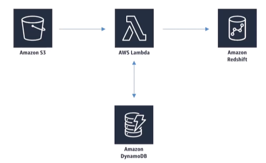
    
- Lambda receives event with batch of stream records → specify batch size (up to 10,000 records)
    
    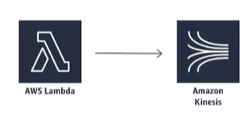
    
    - Too large a batch size can cause timeout → split batches beyond Lambda’s payload limit
    - Lambda retries batch until success or data expiry
        - May stall shard if errors not handled properly
        - Use more shards to ensure processing not held up by errors
    - Lambda processes shard data synchronously, not in parallel
    - When data from streams are out of order or skipped, set concurrency limit so order of processing is preserved and prevents data points from being skipped due to concurrent executions

**Mounting EFS to Lambda** (VPC required)

- Configure mount EFS to local directory during initialization, must leverage EFS Access Points
- Limitations: EFS connection limits (1 instance = 1 connection) and connection burst limits
    
    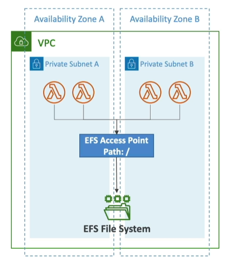
    

**Lambda storage options**

|  | Ephermeral | Lambda Layers | S3 | EFS |
| --- | --- | --- | --- | --- |
| **Size** | 10 GB | 5 layers/fn, 250MB total | Elastic | Elastic |
| **Storage Type** | File System | zip | Object | File System |
| **Details** | Function access only, fastest | Static, immutable, fastest | Atomic operations with versioning |   |
|  |  |  |  |  |

### Serverless Application Model (SAM)

- Framework for developing and deploying serverless apps, all config using YAML code - install on CLI
- Generate complex CloudFormation from simple SAM YAML file
    - Supports Outputs, Mapping, Parameters, Resources, etc.
- Can use CodeDeploy to deploy Lambda functions
- Use to run Lambda, API Gateway, DynamoDB locally

**Recipes**: Transform header, write code, package and deploy
- *AWS::Serverless::Function*
- *AWS::Serverless::Api*
- *AWS::Serverless::SimpleTable*
- `aws cloudformation package` / `sam package`
- `aws cloudformation deploy` / `sam deploy`

**SAM commands**
- `sam build`: SAM YAML + code to CF YAML + code
- `sam package`: upload to s3
- `sam deploy`: create/execute CF ChangeSet → CF Stack created

**CLI Debugging**
- Locally build, test, and debug serverless apps, provide lambda-like execution environment
- SAM CLI + AWS Toolkits → step-through and debug code

### AWS Batch

- **Use case**: High throughput non-ETL computing job (e.g. s3 cleanup); 
    - vs Glue: mainly for ETL and data availability using Data Catalog

- Run batch jobs as Docker images as serverless instances
- Dynamic provisioning of instances
- Schedule Batch jobs using CloudWatch Events
- Orchestrate Batch Jobs using AWS Step Functions

## Containers

### Elastic Container Service (ECS)

**EC2 Launch Type:** Docker Containers = ECS Tasks
- EC2 Instances must be provisioned by us in advance**
- Each EC2 instance must run ECS Agent to register in the ECS Cluster → AWS manages container start/stop

**Fargate Launch Type:** Serverless, no provisioning
- Just create task definitions
- Increase number of ECS Tasks, Fargate manages CPU/RAM needed, no more EC2 instances

**IAM Roles**
- EC2 Instance Profile (EC2 Launch Type only)
    - Used by ECS agent
    - API calling, logging, pull Docker image from ECR, Get SSM data
- ECS Task Role
    - Allow each task to have specific role, use different roles for different ECS services
    - Defined in the **task definition**

**Load Balancer integrations**
- ALB supported and works for most use cases
- NLB recommended only for high throughput/high performance use cases, or pairing with AWS PrivateLink

**Data Volumes (EFS) mounted on all tasks**
- Works for both EC2 and Fargate instances
- Fargate + EFS = Serverless
- Use cases: persistent multi-AZ shared storage
- S3 **CANNOT** be mounted as a file system

### Elastic Container Registry (ECR)

- Store and manage Docker images, Private and Public repos
- Fully integrated with ECS, access controlled through IAM
- Support image vulnerability scans, versioning and tagging, lifecycle management

### Elastic Kubernetes Service (EKS)

- Kubernetes: Open-source system to automatically deploy, scale and manage containerised apps
- Alternative to ECS, similar goal but different API
- Supports EC2 to deploy worker nodes or Fargate to deploy serverless containers
- Use case: company is already using Kubernetes on-prem or in another cloud and want to migrate to AWS
- EKS Pods = ECS tasks

**Node types**
- **Managed Node groups**: create and manage nodes (EC2) for you, part of Auto-scaling Group (ASG) managed by EKS
    - Supports On-demand or Spot instances

- **Self-managed Nodes**: Nodes created by user and registered to EKS cluster, managed by ASG
    - Use pre-built AMI - Amazon EKS Optimised AMI
    - Supports On-demand or Spot instances

- **AWS Fargate:** no maintainence and no nodes managed

- Taints and tolerations (Node affinity): taints can be applied to pods so specific pods can be repelled and only pods with matching tolerations can be scheduled on those nodes

## Analytics

### Glue**

- Serverless discovery and definition of table definition and schema → metadata repo as Glue tables
    - S3 lakes, RDS, Redshift, Other SQL DBs
- Custom ETL jobs, fully managed
    - Trigger-driven, on schedule, or on-demand
- Glue Crawler: scan data in S3 to create schema and populate Glue Data Catalog
    - Redshift Spectrum, Athena, EMR, Quicksight can query S3 as a relational DB
- S3 Partitions: Crawler extracts based on how S3 data is organised
    - Organise by purpose of query, e.g. time range, by device, etc.

**Glue + Hive**

- Hive lets you run SQL-like queries from EMR, Glue Data Catalog can serve as a Hive “metastore”
- Conversely, can import Hive metastore into Glue

**Glue ETL** - auto-code generation in Scala/Python

- Server-side encryption at rest and SSL in transit
- Can be event-driven
- Can provision additional DPUs to increase performance of underlying Spark jobs
    - Use jobs metrics to understand max capacity for DPUs you need
- Errors reported to CloudWatch → tie to SNS for notification
- Code can be modified or provided from user
- Targets: S3, JDBC (RDS, Redshift), Glue Data Catalog
- Fully managed, cost effective, pay per use
- Jobs run on serverless Spark
- Glue Scheduler to schedule jobs, Glue Triggers to automate job runs based on events

**DynamicFrame** (like Spark DataFrame but more ETL)

- Collection of DynamicRecords → self-describing and have a schema
- Scala and Python APIs available

**Transformations**

- Bundled Transformations: DropFields, DropNullFields, Filter, Join, Map
- ML Transformations: FindMatches ML - identify duplicates or matching records in dataset, even with no common unique identifier
- Format conversions: CSV, JSON, Avro, Parquet, ORC, XML
- Apache Spark transformations (eg K-Means)

**ResolveChoice** - deal with ambiguities in DynamicFrame, e.g. two fields with same name

- `make_cols`: create new col for each type
- `cast`: cast all values to specified type
- `make_struct`: Create a structure that contains each data type
- `project`: Project every type to a given type, eg project:string

**Modifying Data Catalog** - updating schemas and partitions

- Add new partitions: re-run crawler or enableUpdateCatalog/partitionKeys in script
- Update schema: re-run craler or enableUpdateCatalog/updateBehaviour in script
- Create new tables: enableUpdateCatalog/updateBehaviour with setCatalogInfo
- Restrictions: S3 only, JSON, CSV, Avro, Parquet (need special code) only, nested schemas not supported

**Development Endpoints** - develop ETL using notebook, then create ETL job that runs your script using Spark and Glue

- Connect to endpoint in VPC with security groups using:
    - Apache Zeppelin on local machine
    - Zeppelin notebook server on EC2 (via Glue console)
    - Sagemaker notebook
    - Terminal window
    - PyCharm professional edition
    - Use Elastic IPs to access private endpoint address

**Running Glue jobs**

- Time-based schedules - cron style
- Job bookmarks - persists state from job run and allow processing of new data only when re-running on schedule instead of re-processing old data
    - Works with S3 sources and relational databases via JDBC (if PKs are in sequential order) - *only new rows, not updated rows**
- CloudWatch Events
    - Fire off Lambda function or SNS when ETL succeeds/fails
    - Invoke EC2 run, send event to Kinesis, activate Step Function

**Cost model** - billed by second for crawler and ETL jobs

- First million stored and accessed are free for Glue Data Catalog
- Development endpoints for developing ETL code charged by the minute

**Glue Streaming**

- Consume from Kinesis or Kafka and clean/transform in-flight, store to S3 or other data stores
- Uses Spark structured streaming

**Anti-patterns**

- Multiple ETL engines not suitable as it is Spark-based
    - For other engines (Hive, Pig, etc.), use EMR

**Glue Studio**

- Visual interface for ETL workflows to create DAGs for complex workflows
    - Sources include S3, Kinesis, Kafka, JDBC
    - Supports partitioning out-of-box
    - Visual job dashboard - overviews, status, run-times
- Can be converted into pro-code (Python) for customisation

**Glue Data Quality**

- Data quality rules may be created manually or recommended automatically
- Uses Data Quality Definition Language (DQDL)
- Results can be used to fail the job or just be reported to CloudWatch
- **Glue Workflows****
- Orchestration tool, design multi-job, multi-crawler ETL processes run together
- Do stuff within Glue only for ETL
- Create from AWS Glue blueprint, console, or API

**Triggers**

- Start jobs or crawlers, or when they complete
    - Cron schedule
    - On-demand
    - Eventbridge (batch number of events , window within X seconds - default 15min)


### Glue DataBrew

- Visual data preparation tool -UI for pre-processing large datasets
    - From S3, data warehouse, or database → S3
- Create transformation recipes that can be saved as jobs within a larger project
- May define data quality rules or create datasets with custom SQL from Redshift and Snowflake

**Security**: KMS, SSL in-transit, IAM, CloudWatch and CloudTrail

**Handling PII in Databrew Transformations**

- Substitution `REPLACE_WITH_RANDOM`
- Shuffling `SHUFFLE_ROWS`
- Deterministic encryption `DETERMINISTIC ENCRYPT`
- Probabilistic encryption `ENCRYPT`
- Decryption `DECRYPT`
- Null out or delete `DELETE`
- Masking out `MASK_CUSTOM`, `_DATE`, `_DELIMITER`, `_RANGE`
- Hashing `CRYPTOGRAPHIC_HASH`

### Lake Formation

- Data lake, partitioning, encryption, define transformation jobs and monitor, access control, auditing
- Anything Glue can do
- Free to use, but underlying services incur cost

**Steps**

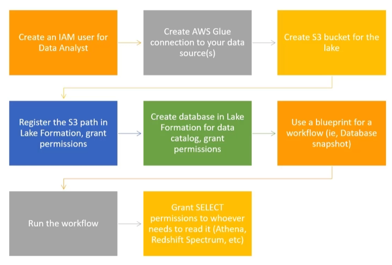

**Finer points**

- Cross-account LakeFormation permissions: recipient must be setup as data lake admin, can use AWS Resource Access Manager for accounts external to organisation, IAM permissions for cross-account access
- LakeFormation does not support manifests in Athena or Redshift queries
- IAM permissions on KMS encryption key is required for encrypted data catalogs in LakeFormation
- IAM permissions needed to create blueprints and workflows

**Governed tables and security** - costed feature

- Supports ACID transactions across multiple tables (use new type of S3 table) - no need to make tradeoff between relational DB for ACID
    - Works with streaming data (Kinesis) and query with Athena
- Storage Optimization and Automatic Compaction: Clears overhead of ACID processing in datalake that piles up over time
- Granular Access Control with Row and Cell-level Security - both for governed and s3 tables

**Data Permissions in LakeFormation**

- Can tie to IAM users/roles, SAML, or external AWS accounts
- Use policy tags on databases, tables or columns
- Can select specific permissions for tables or columns (column-based security)

**Data Filters in LakeFormation for security** (use console or `CreateDataCellsFilter` API)

- Row-level security: “All columns” + row filter
- Column-level security: “All rows” + specific columns
- Cell-level security: Specific columns +specific rows

### Athena

- Interactive query service for S3 (SQL) - no need to load data, uses Presto under the hood, serverless
    - Data formats: CSV,TSV, JSON, ORC, Parquet, Avro
    - Compressions: Snappy, Zlib, LZO, Gzip
- Can be unstructured, semi-structured or structured

**Use cases**: adhoc logs queries, query staging data before RS load, analyse Cloudtrail/VPC/ELB logs in s3, integrated with Jupyter/Zeppelin notebooks like relational DB, integrated with QuickSight

**Athena Workgroups**: Organise users/teams/apps/workloads into Workgroups

- Control query access, track costs
- Integrates with IAM, CloudWatch, SNS
- Each workgroup has own query history, data limits, IAM policies, encryption settings

**Athena cost model** - $5 per TB scanned, successful or cancelled queries count, failed queries do not

- No charge for DDL (CREATE/ALTER/DROP etc.)
- Save LOTS of money by using columnar formats e.g. ORC, Parquet → save 30-90% and get better performance (partitioning is also cost-saving)
- Glue and S3 have their own charges

**Security**

- IAM, ACLs, S3 bucket policies
- AmazonAthenaFullAccess / AWSQuicksightAthenaAccess
- Encrypt results at rest in S3 staging directory:
    - Server-side encryption with SSE-S3, SSE-KMS
    - Client-side encryption with CSE-KMS
- Transport Layer Security (TLS) encrypts in-transit (Athena and S3)

**Anti-patterns**

- Highly-formatted reports/visualisations → use QuickSight instead
- ETL → use Glue instead

**Optimising Athena performance**

- Use columnar formats (ORC, Parquet)
- Small number of large files better than large number of small files
- Use partitions → if adding partitions on existing unpartitioned table, use `MSCK REPAIR TABLE` command

**Athena ACID transactions support using Apache Iceberg**

- Use `table_type = 'ICEBERG'` in `CREATE TABLE` command
- Concurrent users can safely make row-level modifications
- Compatible with EMR, Spark, anything that supports Iceberg table format
- Removes need for custom record locking
- Time travel operations → recover data recently deleted with `SELECT` statement
- Same ACID features as governed tables in LakeFormation
- Benefits from periodic compaction to preserve performance, but must be manually run periodically (unlike governed tables → auto-compact) → `OPTIMISE table REWRITE DATA USING BIN_PACK WHERE catalog = ‘c1’`

**Fine-grained Access to AWS Glue Data Catalog**

- IAM-based DB and table-level security → broader than data filters in LakeFormation, cannot restrict to specific table versions
- Minimally require policy that grants access to DB and Glue Data Catalog in each region
- Can setup policies in IAM to restrict access to:

    `ALTER` or `CREATE DATABASE`, `CREATE TABLE`, `DROP DATABASE` or `DROP TABLE`, `MSCK REPAIR TABLE`, `SHOW DATABASES` or `SHOW TABLES`
    
- Just need to map these operations to their IAM actions

**`CREATE TABLE AS SELECT`** - available in Athena but also available in other DBs

- Create new table from query results
- Can also be used to convert data into a new underlying format → trick to use Athena to convert data from S3
- Difference from Glue ETL: Glue has bookmarks to track where it has last left off
- **Apache Spark**
- Distributed processing framework - better than MapReduce due to in-memory caching and optimised query executor
- SparkSQL, MLLib, Spark Streaming, GraphX

**How Spark works**

- Spark apps run as independent processes on cluster
- SparkContext (driver program) coordinates them through a Cluster Manager (e.g. YARN)
- Executors run computations and store data, SparkContext sends application code and tasks to executors

**Spark Streaming** - usually refer to data as a dataset

- Data stream as an unbounded Input Table
```
val inputDF = spark.readStream.json("s3://logs")
inputDF.groupBy($"action",window($"time”,"1 hour").count().writeStream.format("jdbc").start("jdbc:mysql//…")
```

**Integration with Kinesis**

- Kinesis producer → Kinesis Data Streams ← Spark dataset implemented from KCL

**Intregration with Redshift**

- spark-redshift package allows Spark datasets from Redshift → Spark SQL data source, useful for ETL using Spark
- e.g. S3 → Redshift → ETL with EMR (Spark) → Redshift → …

**Integration with Athena**
S
- Run Jupyter notebooks with Spark within Athena console → notebooks may be encrypted automatically or with KMS
- Totally serverless
- Selectable as an alternate analytics engine (vs Athena SQL)
- Uses Firecracker for quickly spinning up Spark resources
- Programming API/CLI access - `create-work-group`, `create-notebook`, `start-session`, `start-calculation-execution`
- Can adjust DPUs for coordinator and executor, price based on compute usage and DPU/hr

### Amazon Elastic MapReduce (EMR)

- Managed Hadoop on EC2 - includes Spark, HBase, Presto, Flink, Hive, and more (low-level access to open-source frameworks possible)
- EMR Notebooks - dev interface in browser
- Several integration points with AWS

**EMR Cluster**

- Master (leader) node: Manages the cluster → tracks tasks status, monitor cluster health
- Core node: Hosts HDFS data and runs tasks, can be scaled up and down, but with some risk. Multi-node clusters have at least one
- Task node: Runs tasks, does not host data. Optional and no risk of data loss when removed → good to use spot instances

**EMR Usage**

- Transient clusters terminate once all steps are complete → load, process, store, shut down → saves money
- Long-running clusters must be manually terminated
    - Basically a data warehouse with periodic processing on large datasets
    - Task nodes using Spot instances for temporary compute capacity
    - Reserved instances on long-running clusters to save $
    - Termination protection on by default, auto-termination off
- Frameworks and apps specific at cluster launch (e.g. Spark)
- Connect directly to master to run jobs directly
- Or, submit ordered steps in graphical manner via console → process data in S3/HDFS, output to S3
    - Once defined, steps can be invoked via console

**EMR/AWS Integration**

- EC2 as instances
- VPC to configure virtual network
- S3 stores input and output data
- Cloudwatch monitors cluster performance and configure alarms
- IAM permissions
- CloudTrail audit requests made to servie
- AWS Data Pipeline to schedule and start clusters

**EMR Storage**

- Hadoop Distributed File System (**HDFS**) - multiple copies stored accross cluster instances for redundancy (128MB data blocks by default)
    - Ephermal - data lost when cluster shuts down
    - In-place data processing with Hadoop
- **EMRFS**: access S3 as if it here HDFS
    - Allow persistent storage after cluster termination
    - S3 is strongly consistent since 2021 → multiple nodes can write to S3 at same time
        
        **EMRFS Consistent View** - Optional for S3 consistency, uses DynamoDB under the hood to track consistency (multiple nodes writing to S3 at same time) - NO LONGER AN ISSUE
        
- Local file system: Suitable for temporary data only (buffer, caches, etc) - ephermal
- EBS for HDFS: allow use of EMR on EBS-only types (M4,C4)
    - Deleted when cluster is terminated
    - EBS volumes can only be attached at cluster launch, not after
    - EMR treats manual EBS volume detach as failure and replaces it

**EMR Promises**

- Charges by hour, plus EC2 costs
- Provisions new nodes if core node fails
- Can add/remove task nodes on the fly
    - Increase processing capacity, but not HDFS capacity
- Can resize running cluster’s core nodes
    - Increase both processing and HDFS capacity (good if not using EMRFS on S3 for storage)
- Core nodes can be added/removed → risk data loss

**EMR Managed Scaling**

- Old: EMR Automatic scaling - custom scaling rules based on CloudWatch rules, only instance groups
- Managed Scaling supports instance groups and instance fleets (w diff instance types)
    - Scales spot, on-demand, and instances in a Savings Plan within the same cluster
    - Available for Spark, Hive, YARN workloads
- Scale-up strategy: First add core nodes, then task nodes, up to max unit specified
- Scale-down strategy: First remove task nodes, then core nodes, no further than min constraints
    - Spot nodes always removed before on-demand instances

**What is Hadoop?**

- MapReduce: Framework for distributed data processing - map data to key/val pairs and reduce intermediate results to final output
- YARN: Manages cluster resources for multiple data processing frameworks
- HDFS: Distribute data blocks across cluster in redundant manner, ephermal on EMR

**EMR Serverless**

- Choose EMR Release and Runtime (Spark, Hive, Presto)
- Submit queries/scripts via job run requests
- Underlying capacity is managed, but default worker sizes and pre-init capacity can be specified
    - EMR computes resources needed for jobs, schedules workers accordingly, in 1 region
- No longer have to estimate how many workers needed for workloads
- While serverless, still need to think about worker nodes and how they are configured

**Using EMR Serverless**

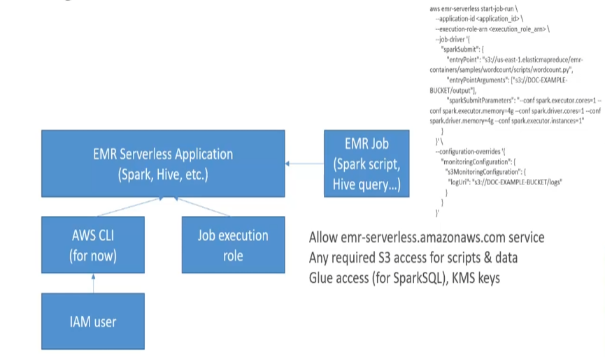

**EMR Serverless Application Lifecycle**

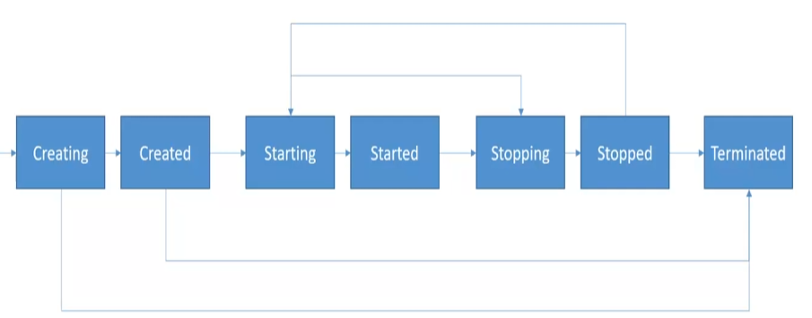

- Not all automatic → must call APIs CreateApplication, StartApplication, StopApplication and importantly DeleteApplication to avoid excess charges

**Pre-initialised Capacity**: Spark adds 10% overhead to memory requested for drivers and executors

- Ensure initial capacity at least >10% than requested by job

**EMR and EMR Serverless Security**

- **EMRFS** - S3 encryption (SSE, CSE) at rest, TLS in transit between EMR nodes and S3
- **S3** - SSE-S3, SSE-KMS
- Local disk encryption
- Spark communication between drivers and executors is encrypted
- Hive communication between Glue Metastore and EMR uses TLS
- Force HTTPS (TLS) on S3 policies with `aws:SecureTransport`

**EMR on Elastic Kubernetes Service (EKS)** - fully managed

- Allow submitting Spark jobs on EKS without provisioning clusters
- Share resources between Spark and other apps on K8s

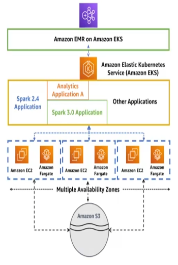

### Kinesis Data Streams, Firehose

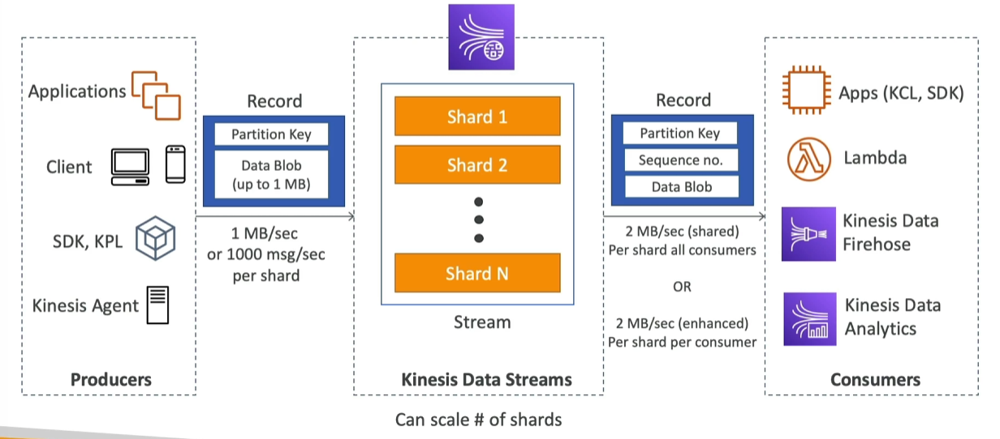

- Retention between 1-365 days
- Ability to reprocess (replay) data
- Once data inserted into Kinesis, it cannot be deleted (immutable)
- Data that shares the same partition goes to the same shard (ordering)

**Kinesis Data Streams - Capacity Modes**
- **Provisioned mode**
    - Choose # of shards provisioned, scale manually or using API
    - Each shard gets 1MB/s in (100records/s), and 2MB/s out (classic or enhanced fan-out for consumers)
    - Pay per shard provisioned/hr
- **On-demand mode**
    - No need to provision or manage capacity
    - Default capacity provisioned -> 4 MB/s in or 4000 records/s
    - Scales automatically based on observed throughout peak during last 30 days
    - Pay per stream/hr and in+out data/GB

**Security**
- Control access/authorization using IAM
- Encryption in flight using HTTPS endpoints
- Encryption at reast using KMS
    - Can implement encrypt/decrypt on data client-side (harder)
- VPC Endpoints available for Kinesis to access within VPC
- Monitor API calls using CloudTrail
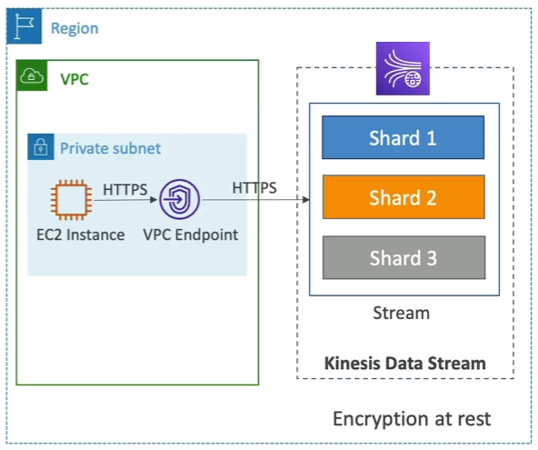

**Kinesis Producers**
- **Kinesis SDK** - PutRecord(s)
    - API used: `PutRecord` (one) and `PutRecords` (many)
    - `PutRecords` use batching and increases throughput -> less HTTP requests
    - **Use case**: low throughput, high latency, simple API, AWS Lambda
    - Managed AWS sources that use ProducerSDK: CloudWatch Logs, AWS IoT, Kinesis Data Analytics
    - `ProvisionedThroughputExceeded` exception if we go over limits
        - Happens when sending more data (exceeding MB/s or TPS for any shard)
        - Make sure you don't have a hot shard (eg. bad partition key, too much data goes into one partition)
        - Solution: retry with backoff, scale-up shards, ensure good partitioning

- **Kinesis Producer Library (KPL)**
    - Easy to use and highly configurable C++/Java library
    - Used for building high performance, long-running producers
    - Automated and configurable retry mechanism
    - Synchronous or **Asynchronous**** (better performance for async)
    - **Batching** (both turned on by default) - increase throughput, decrease cost
        - Collect records and write to multiple shards in same PutRecords API call
        - Aggregate: capability to store multiple records in one record (exceed 1000 records/s limit) to increase payload size and improve throughput (maximize the 1MB/s limit at the cost of increased latency)
        - Set batching efficiency by introducing some delay with `RecordMaxBufferedTime` (default 100ms)
        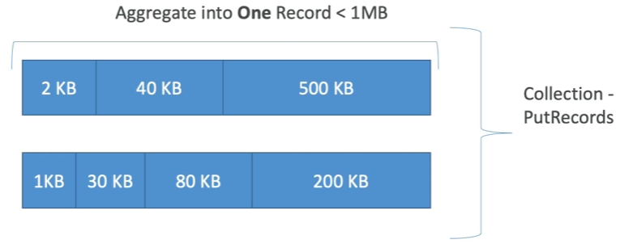
        - Compression must be implemented on user side
        - KPL Records must be decoded with KCL or special helper library
    
    - **When NOT to use KPL**: Apps that cannot tolerate additional delay due to large `RecordMaxBufferedTime` values (i.e. latency)
    - e.g. KPL keeps data even when app goes offline, while `PutRecords` API delivers only latest data directly to stream
    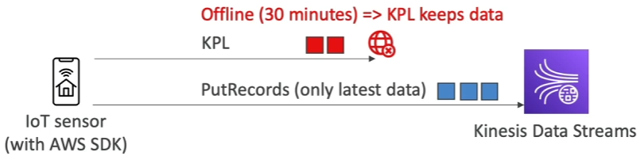

- **Kinesis Agent** - Linux program running on server to monitor log files and send reliably to Kinesis streams
    - Java-based agent, built on top of KPL
    - Features:
        - Write from multiple directories and write to multiple streams
        - Routing feature based on directory/log file
        - Pre-process data before sending to streams (single line, csv to json, log to json)
        - Handles log file rotation (log file aggregation), checkpointing, retry upon failures
        - Emits metrics to CloudWatch for monitoring
- 3rd party libraries: Spark, Log4j Appenders, Flume, Kafka Connect, Nifi

**Kinesis Consumers** - Classic
- **Kinesis SDK** - `GetRecords`
    - Classic Kinesis - records polled from shard, each has 2MB total aggregate throughput
    - `GetRecords` returns up to 10MB of data (then throttle for 5sec) or up to 10,000 records
    - Max 5 `GetRecords` API calls/shard/s -> 200ms latency
        - if 5 consumer apps consume from same shard, each can poll once/s and receive < 400KB/s -> solve using consumer fan-out feature

- **Kinesis Client Library (KCL)**
    - Java-first library, but exists for other langs too (Golang, Python, Ruby, Node, .NET)
    - Read records from Kinesis produced from KPL (de-aggregation feature)
    - Multiple consumers share multiple shards in a 'group' -> shard discovery
    - **Checkpointing** feature to resume progress
    - Leverages DynamoDB for coordination and checkpointing (one row/shard)
        - Ensure enough DynamoDB WCU/RCU is provisioned, or use On-demand mode, otherwise it may slow down KCL
    - Record processors will process the data
    - `ExpiredIteratorException` -> increase WCU, DynamoDB table not fast enough to keep up with writes

- **Kinesis Connector Library** - older Java library (2016) that leverages KCL - might be deprecated soon
    - Writes data to S3, DynamoDB, Redshift, OpenSearch
        - Kinesis Firehouse replaces it for some targets, Lambda for others

- 3rd party libraries: Spark*, Log4j, Flume, Kafka Connect

- **Kinesis Firehose**
- **AWS Lambda**
    - Lambda consumer has library to de-aggregate record from KPL
    - Lambda can be used to run lightweight ETL to S3, DynamoDB, RedShift, OpenSearch, or others
    - Can use to trigger notifications/send emails in real time
    - Configurable batch size, i.e. how much should Lambda read at a time from Kinesis

**Kinesis Enhanced Fan Out**: 
- Each consumer get 2MB/S of provisioned throughput per shard -> 20 consumers will get 40MB/s per shard aggregated -> NO MORE 2MB/s limit
- Data is pushed from Kinesis to consumers over HTTP/2
- **Difference vs standard consumers**
    - Multiple consumer apps for same stream, default limit is 20/stream
    - Reduced latency (~70ms) vs 200ms
    - Higher costs
    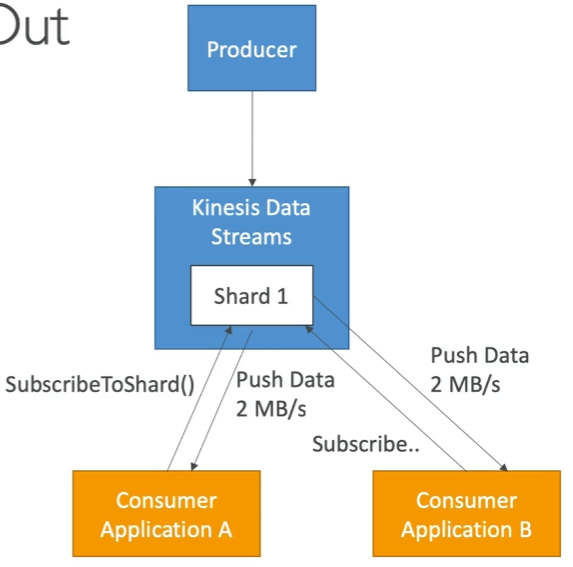

**Kinesis Scaling**
- **Adding shards (shard splitting)**: Increase stream capacity, 1MB/s data in per shard
- Can be used to divide "hot shard"
- Old shard before split is closed and will be deleted once data expires
    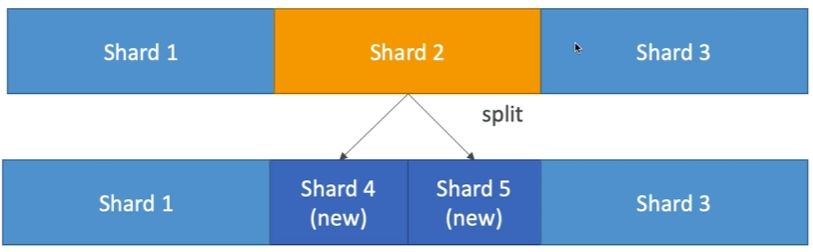

- **Merging shards**: Decrease stream capacity to save costs if two shards have low traffic
- Old shards closed and deleted after data expires

- **Out-of-order records after resharding**: After reshard, consumers can read from child shard while unread data still exists in parent shard -> data not in order.
    - Solution: after reshard, read parent records entirely until no new records
    - KCL has logic built-in to handle this after resharding operations

- **Auto-scaling**: not native feature of Kinesis, manual API call that changes number of shards is `UpdateShardCount` -> implement using AWS Lambda ([Link](https://aws.amazon.com/blogs/big-data/scaling-amazon-kinesis-data-streams-with-aws-application-auto-scaling/))

- **Scaling Limitations**
    - Cannot be done in parallel, so plan capacity in advance
    - Only one resharding operation at a time, takes a few seconds. i.e. 1000 shards takes 30,000s (8.3h) to double to 2000 shards
        <details>
        <summary>You can't do the following:</summary>
        - Cannot scale more than 10x for each rolling 24h period for each stream
        
        - Cannot scale up to more than double current shard count for a stream
        
        - Cannot scale down below half your current shard count for a stream
        
        - Cannot scale up to more than 500 shards in a stream
        
        - Cannot scale a steram with >500 shards down unless result is <500 shards
        
        - Cannot scale up to more than shard limit for account
        </details>
    
**Handling Duplicates for Producers** (rarely occurs)
- Producer retries can create duplicates due to **network timeouts** -> two records with identical data and unique sequence numbers
    - Fix: **embed unique record ID** in data to de-duplicate on consumer side
    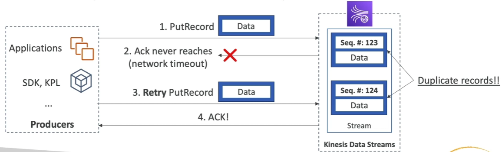

**Handling Duplicates for Producers**
- Can make application read same data twice, happens when record processors restart:
    - Worker terminates unexpectedly
    - Worker instances and added or removed
    - Shards are merged or split
    - App is deployed
- Fix 1: ensure consumer app is idempotent (even if processed twice, it does not have twice the effect)
- Fix 2: If final destination can handle duplicates, it's recommended to do it there (based in unique ID)
- [More info](https://docs.aws.amazon.com/streams/latest/dev/kinesis-record-processor-duplicates.html)

<details>
<summary><b>Kinesis Security</b></summary>

- Control access/auth using IAM

- Encryption in flight using HTTPS endpoints, at-rest using KMS

- Client-side encryption must be manually implemented (harder)

- VPC Endpoints available for Kinesis to access within VPC

</details>
    
**Kinesis Data Firehose**: Stores data into target destinations
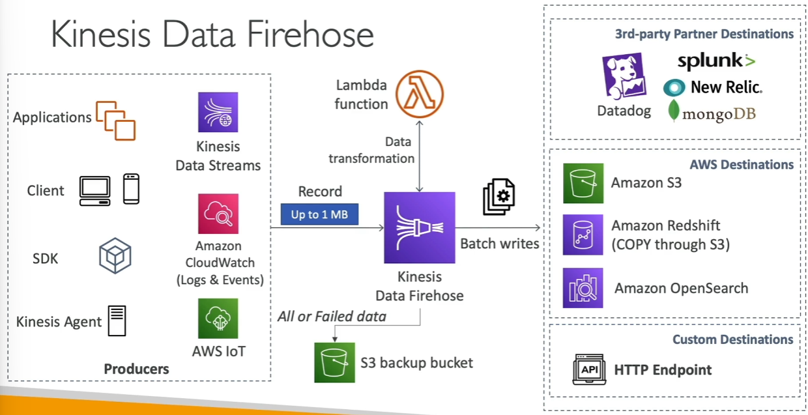
- Read records, up to 1MB at a time
- Batch writes into destinations efficiently
- Near real-time service (60s latency minimum for non-full batches)
- Destinations: Redshift, S3, OpenSearch , Splunk
- Automatic scaling
- Data Conversions from JSON to Parquet/ORC (only for S3)
- Data Transformation through AWS Lambda (eg. csv to JSON)
- Supports compression when target is S3 (GZIP, ZIP, SNAPPY)
- Store **source records, transformation failures, delivery failures** into another backup S3 bucket
- Pay for the amount of data going through Firehose
- **Spark / KCL do NOT read from KDF**

    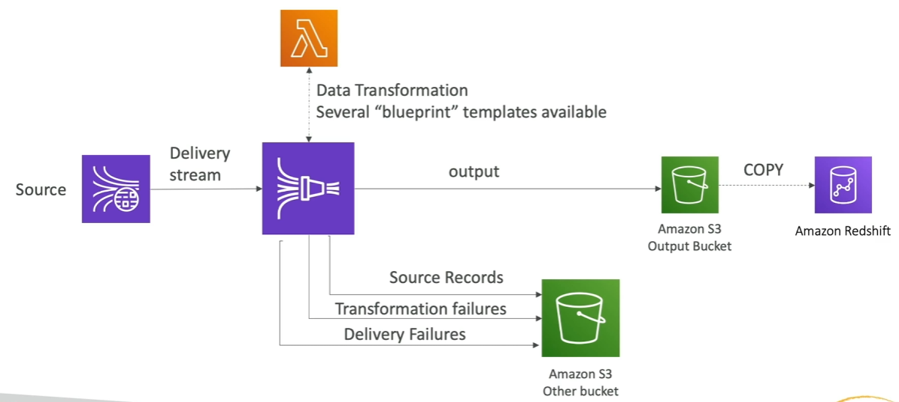

- **Firehose buffer sizing**: accumulated data in buffer flushed based on time and size rules
    - Buffer size (e.g. 32MB), flushed once reached
    - Buffer time (e.g. 2mins), flushed once reached
    - Firehose can auto-increase buffer size to increase throughput
    - High throughput -> buffer size will be hit
    - Low throughput -> buffer time will be hit

**Kinesis Data Streams vs Firehose**

|  | Kinesis Data Streams | Kinesis Data Firehose |
| --- | --- | --- |
| **Coding** | Custom code | Fully managed |
| **Speed** | Real time<br><i>Classic ~200ms<br>Fanout ~70ms</i> | Near real time<br><i>Min buffer time 1min</i> |
| **Scaling** | Manual<br>(shard splitting, merging) | Automated scaling |
| **Storage** | Data storage<br>(1 - 365 days) | No storage<br>Send to S3, Splunk, Redshift, OpenSearch |
| **Lambda use cases** | Insert data in real time to OpenSearch | Serverless data transformations |
|  |  |  |

**CloudWatch Logs Subscription Filters**
- Send logs to destinations: Kinesis Data Streams, Firehose, Lambda
- Example use cases

    - **Logs subscription filter patterns in near real-time into Amazon ElasticSearch**
        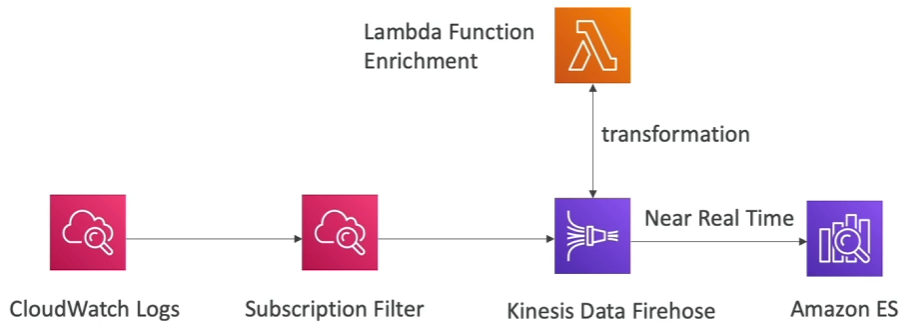

    - **Logs subscription filter patterns real-time load into Amazon ElasticSearch**
        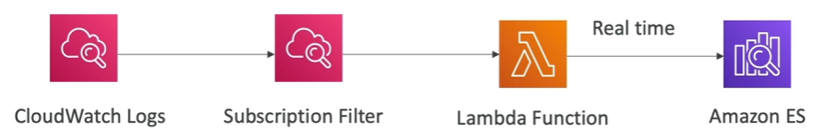

    - **Logs subscription filter patterns for real-time analytics**
        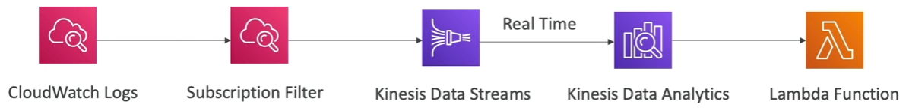

**Troubleshooting and Performance Tuning for Kinesis Data Streams**
- **Performance**
    - **Slow writing** - Service limits may be exceeded
        - Check for throughput exceptions, see what operations are being throttled. different calls have different limits
        - Shard-level limits for writes and reads
        - Other operations (`CreateStream`, `ListStreams`, `DescribeStreams`) have stream-level limts of 5-20 calls/sec
        - Select partition key to evenly distribute puts across shards
    - **Large producers** - Try to batch items up
        - Use KCL, `PutRecords` with multi-records, or aggregate records into larger files
    - **Small producers (i.e. apps)**
        - Use `PutRecords` or Kinesis Recorder in the AWS Mobile SDKs


### Amazon Managed Streaming for Apache Kafka (MSK)

- 

### OpenSearch Service

- 

### QuickSight

- 

## App Integration

### SQS

- 

### SNS

- 

### Step Functions**

- 

### AppFlow

- 

### EventBridge

- 

### Amazon Managed Workflows for Apache Airflow (MWAA)

- 

## Security, Identity and Compliance

### Principles

- 

### IAM

- 

### KMS

- 

### Secrets Manager

- 

### WAF, Shield

## Networking and Content Delivery

### VPC

- 

### AWS PrivateLink

- 

### Route53

- 

### CloudFront

## Management and Governance

### CloudWatch

- 

### CloudTrail, CloudTrail Lake

- 

### AWS Config

- 

### AWS CloudFormation

- 

### SSM Parameter Store

- 

## Machine Learning

### Sagemaker

- 

## Developer Tools

### AWS CDK

- 

### CodeDeploy, CodeCommit, CodeBuild, CodePipeline

- 

## Acknowledgements
